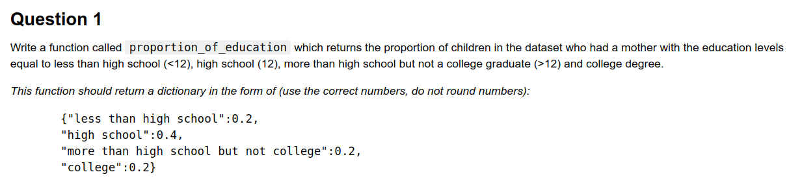

# Projects and exercises for *"Data Science in Python"* course
-------------------------------------
### Exercise 3: Data manipulation with Pandas (2)

Code for following Exercises availabe in **Ex_3.1.py** file

 

-------------------------------------

### Exercise 2: Data manipulation with Pandas (1)

Code for following Exercises availabe in **Ex_2.1.py** file

 

 

-------------------------------------
### Exercise 1: working with regex

 
